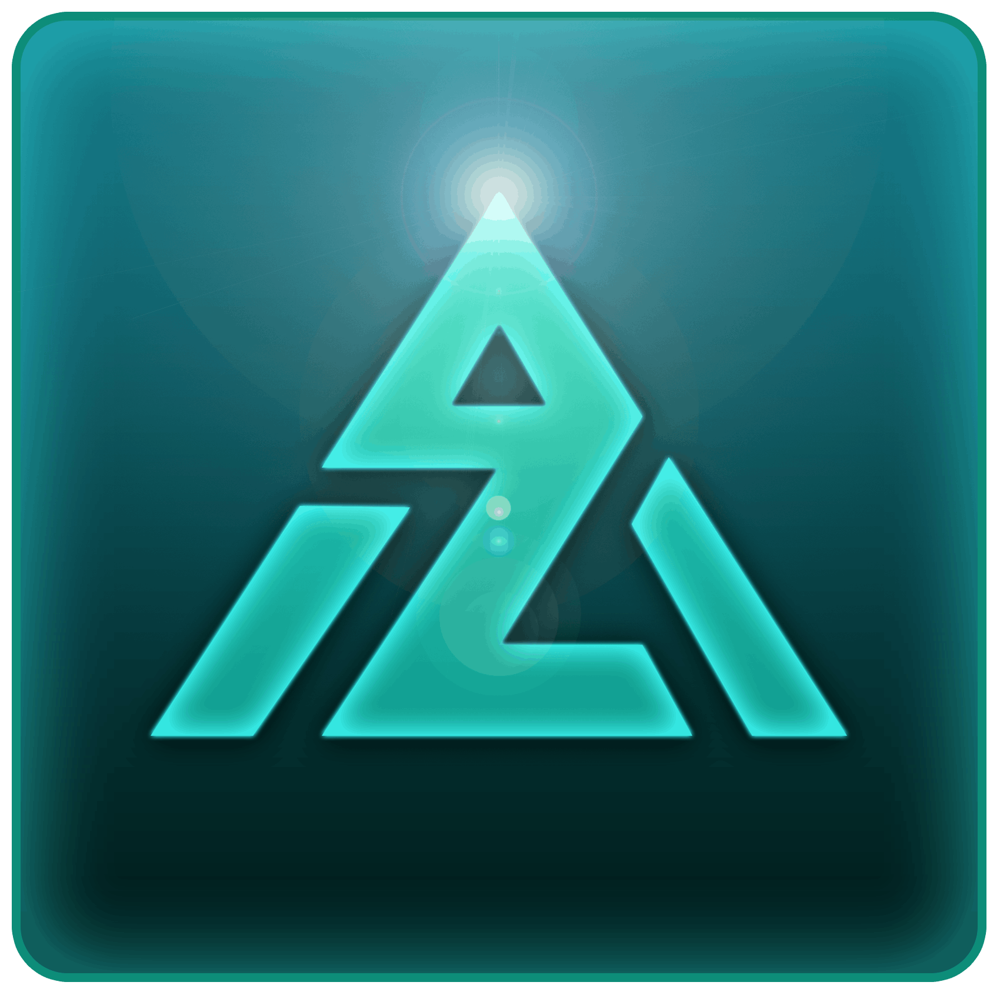

# 🚀 Zenit - Kiosk Framework (Tauri v2 Edition)




---

## 💡 ¿Alguna vez te ha pasado que en tu tienda de venta de computadores no encuentras una forma de mostrar de forma resumida el hardware de tu equipo?

**Zenit lo hace automático.** 

Zenit es una solución de nivel empresarial para **Showcase Terminals**, diseñada específicamente para equipos de exhibición en puntos de venta (Retail). Olvídate de configurar manualmente las specs de cada equipo; Zenit detecta el hardware y lo presenta de una forma visualmente impactante y profesional.

---

## ✨ Características Principales

### 🖥️ Detección de Hardware Inteligente (Powered by PowerShell & WMI)
Zenit utiliza un potente motor de telemetría basado en Rust y PowerShell para extraer y mostrar de forma resumida:
- **Procesador (CPU)**: Identificación exacta y limpia (ej. Intel Core 5, Ryzen AI, Core Ultra). Limpieza automática de marcas registradas ((R), (TM)).
- **Generaciones Modernas**: Soporte para Intel Core Series 1, Series 2 y Ultra.
- **Gráficos (GPU)**: Detección inteligente de modelos integrados y dedicados.
- **Resolución Nativa**: Detección via `WmiMonitorListedSupportedSourceModes` para obtener la resolución real máxima ignorando el escalado de Windows.

### 🏷️ Personalización Comercial (E-Commerce Ready)
- **Precios Dinámicos**: Configura y muestra el precio actual del equipo directamente en pantalla.
- **Gestión de SKU**: Incluye el código de producto para facilitar la búsqueda en bodega o sistema de ventas.
- **Branding de Retail**: Soporte para logos de retails (**Falabella, Paris, Ripley**) y marcas líderes (**Asus, Acer, HP, Lenovo**, etc.).

### 🎥 Gestión Multimedia "Premium"
- **Bóveda de Videos**: Gestor inteligente de videos con almacenamiento local persistente.
- **Alias de Marketing**: Asignación de nombres estéticos a archivos de video (ej. "Campaña Navidad" en lugar de `video_1.mp4`).
- **Autocompletado**: Captura automática del nombre del archivo al subir nuevos clips.
- **Inactividad Visual**: Ocultamiento automático del cursor durante la reproducción de videos de pantalla completa.

---

## 🔒 Seguridad y Kiosko Inteligente

### ⏱️ Monitoreo de Inactividad Global
A diferencia de otros protectores de pantalla, Zenit no usa un temporizador "ciego".
- **Hardware polling**: Utiliza la API nativa de Windows `GetLastInputInfo` para monitorear mouse y teclado en todo el sistema.
- **Uso Respetuoso**: Si estás mostrando algo al cliente o usando otra app, Zenit se mantendrá oculto. Solo regresará a pantalla completa tras 3 minutos de inactividad **total** del equipo.

### 🛡️ Modo Kiosko Robusto
- **Anti-Focus Theft**: Mantiene la aplicación siempre al frente, bloqueando intentos de minimizarla.
- **Bloqueo Total de Atajos**: Inhabilita `Alt+Tab`, `Win+D`, `Alt+F4`, etc.
- **Ventana de Retorno Compacta**: Mini-interfaz elegante para volver a Zenit rápidamente después de probar el equipo.

---

## 🚀 Instalación y Desarrollo

### Requisitos
- Windows 10/11 con **Webview2**.
- [Node.js](https://nodejs.org/) v20+.
- [Rust](https://www.rust-lang.org/) (Stable).

### Comandos Rápidos
```powershell
# Instalar dependencias
npm install

# Modo Desarrollo (HMR)
npm run tauri:dev

# Compilar para Producción (Crea instalador NSIS)
npm run tauri:build
```

---

## 📁 Estructura del Proyecto

- **`src-tauri/`**: Backend en Rust (Seguridad, Store, PowerShell Bridge, APIs de sistema, Metadatos JSON).
- **`src/`**: Aplicación Frontend (Vue 3, Pinia).
- **`public/assets/logos/`**: Catálogo de logos integrados.
- **`*.ps1`**: Scripts de telemetría personalizados.

---

## 🔑 Acceso Administrativo
Ajusta los precios, SKU, videos y logos mediante el **panel oculto**. Para acceder, utiliza el **Hotspot invisible** en la esquina superior izquierda e introduce la clave maestra (**"demo"**). Existe otro Hotspot en la esquina inferior derecha para cerrar Zenit.

---

> **Zenit** no es solo un software de vitrina, es la herramienta de ventas definitiva para el retail tecnológico. Construido con ❤️ para entornos 24/7.
