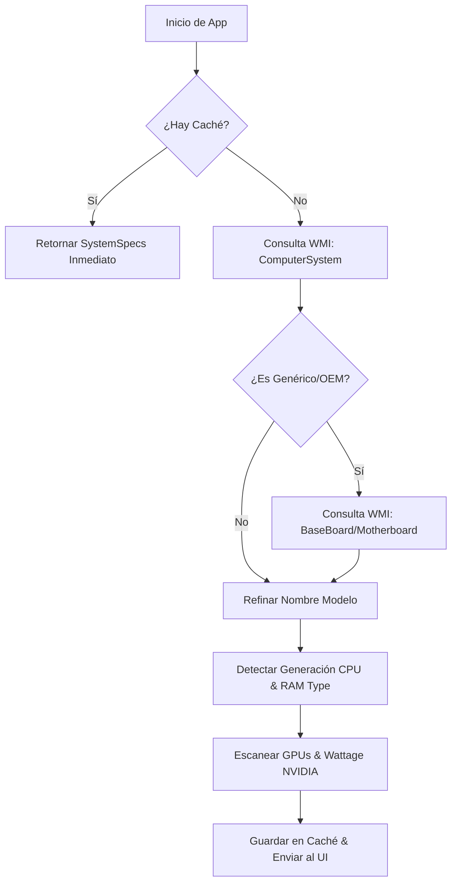
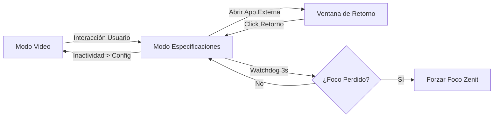

# 🚀 Zenit - Kiosk Framework (Tauri v2 Edition)


---

## 💡 ¿Alguna vez te ha pasado que en tu tienda de venta de computadores no encuentras una forma de mostrar de forma resumida el hardware de tu equipo?

**Zenit lo hace automático y nativo.** 

Zenit es una solución de nivel empresarial para **Showcase Terminals**, diseñada específicamente para equipos de exhibición en puntos de venta (Retail). Olvídate de configurar manualmente las specs de cada equipo; Zenit detecta el hardware en tiempo real y lo presenta de una forma visualmente impactante y profesional.

---

## ✨ Características Principales (v1.2.0)

### 🖥️ Detección de Hardware Nativa (100% Rust & CIM/WMI)
Zenit utiliza un motor de telemetría modularizado en Rust para una velocidad y precisión quirúrgica:
- **Procesador (CPU)**: Identificación exacta de generaciones (Intel 14th/Core Ultra, Ryzen 7000/AI) con limpieza de marcas.
- **Gráficos (GPU)**: Identificación inteligente con detección de **Wattage (TGP)** nativa para NVIDIA mediante `nvidia-smi`.
- **Memoria RAM**: Detección de capacidad física y tecnología (**DDR4, DDR5, LPDDR5**) mapeada por SMBIOS.
- **Almacenamiento Comercial**: Suma de discos con redondeo comercial (ej. 476GB -> 512GB SSD).
- **Resolución Real**: Soporte para resoluciones exóticas (WUXGA, QHD+, 3.2K, UHD+) con etiquetas comerciales automáticas.

### 📐 Optimización High-DPI y Layout
- **Soporte de Escala**: Adaptación dinámica para pantallas de 14" con escalado de Windows al 150%, manteniendo la legibilidad y el orden visual.
- **Validación de Entradas**: Sistema de restricciones (maxlength, character limits) en el panel administrativo para evitar desbordamientos de texto en las tarjetas de especificaciones.

### 🏷️ Personalización Comercial (E-Commerce Ready)
- **Precios Dinámicos**: Soporte para precios de oferta (Exclusivo Tarjeta) y normales, con diseño premium adaptable.
- **Branding de Retail**: Soporte para logos de retails (**Falabella, Paris, Ripley**) y marcas líderes (**Asus, HP, Samsung**) con escalado automático.
- **Unidades Uniformes**: Formato de texto profesional sin espacios inconsistentes (`16GB`, `512GB`, `115W`).

### 🎥 Gestión Multimedia "Premium"
- **Bóveda de Videos**: Gestor inteligente con almacenamiento local persistente y alias de marketing.
- **Inactividad Visual**: Forzado de brillo al 100%, desactivación de brillo adaptativo y ocultamiento de cursor.
- **Failsafe Watchdog**: Reinicio automático de videos si se detectan pausas o errores de reproducción.

---

## 📦 Instalación

### Vía Winget (Recomendado)
Puedes instalar Zenit directamente desde el repositorio oficial de Microsoft Winget:
```powershell
winget install Rouchant.Zenit
```

### Manual
1. Descarga el instalador `.exe` desde la sección de [Releases](https://github.com/Rouchant/Zenit-Tauri/releases).
2. Ejecuta el asistente de instalación.

---

## 🛠️ Desarrollo

### Requisitos
- Windows 10/11 con **Webview2**.
- [Node.js](https://nodejs.org/) v20+.
- [Rust](https://www.rust-lang.org/) (Stable 1.77.2+).

### Comandos Rápidos
```powershell
# Instalar dependencias
npm install

# Modo Desarrollo (HMR)
npm run dev

# Compilar para Producción (Genera Zenit_1.2.0_x64-setup.exe)
npm run tauri build
```

---

## 📊 Diagramas de Arquitectura

### 🛠️ Flujo de Detección de Hardware
Este diagrama muestra cómo Zenit asegura que siempre haya información válida, saltando de la BIOS al hardware si es necesario.



### ⏱️ Ciclo de Inactividad y Kiosko
Muestra el comportamiento del "Watchdog" de inactividad que mantiene la app protegida.



---

## 📚 Catálogo de Funciones (Tauri API)

Zenit expone una serie de comandos nativos en Rust para el control total del equipo:

### 🖥️ Telemetría y Sistema (`system.rs`)
1.  **`get_system_specs`**: Ejecuta el escaneo completo de hardware (CPU, GPU, RAM, VRAM, SSD) con lógica de redondeo comercial y caché persistente.
2.  **`set_max_brightness`**: Script de bajo nivel que fuerza el brillo al 100%, desactiva el ahorro de energía y el brillo adaptativo de Windows.
3.  **`get_video_path`**: Resuelve la ruta física absoluta de los recursos multimedia según el entorno (desarrollo o producción).

### 🪟 Gestión de Ventanas (`window.rs`)
4.  **`minimize_app`**: Minimiza el kiosko de forma segura y lanza la "Ventana de Retorno" para permitir pruebas del equipo.
5.  **`restore_app`**: Cierra la ventana de retorno y recupera el foco absoluto de la aplicación principal.
6.  **`set_always_on_top`**: Alterna la jerarquía de la ventana para asegurar que Zenit sea siempre lo primero que vea el cliente.
7.  **`quit_app`**: Cierre administrativo que asegura que todos los hilos y procesos huérfanos se detengan correctamente.

### 🎥 Bóveda de Videos (`vault.rs`)
8.  **`list_custom_videos`**: Escanea el directorio de recursos para identificar videos locales.
9.  **`save_custom_video`**: Gestiona la importación de nuevos archivos de video a la bóveda local.
10. **`delete_custom_video`**: Elimina recursos de forma física y limpia la base de datos de alias.

---

## 🔑 Acceso Administrativo
El panel de configuración está protegido. Para acceder:
1.  **Ajustes**: 4 clics rápidos en el **Hotspot invisible** (esquina superior derecha). Clave por defecto: `"demo"`.
2.  **Salir**: 4 clics rápidos en el **Hotspot invisible** (esquina inferior derecha). Requiere clave.

---

> **Zenit** no es solo un software de vitrina, es la herramienta de ventas definitiva para el retail tecnológico. Construido con ❤️ para entornos 24/7.
