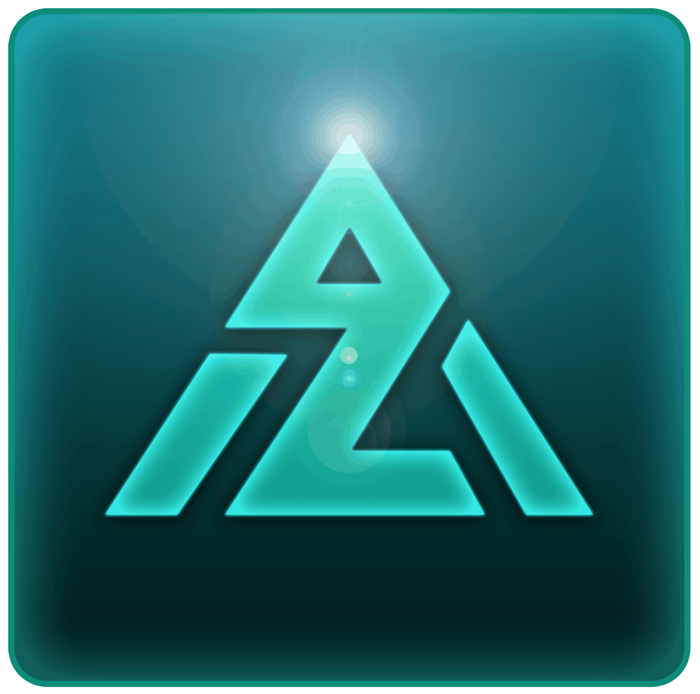
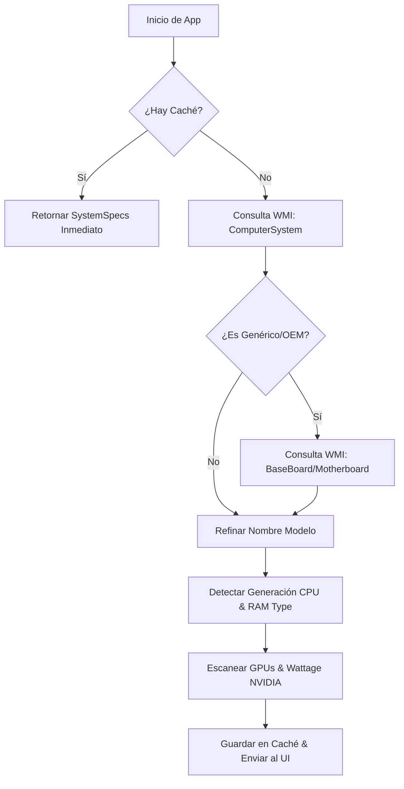
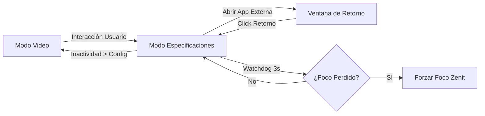

# 🚀 Zenit - Kiosk Framework (Tauri v2 Edition)




---

## 💡 ¿Alguna vez te ha pasado que en tu tienda de venta de computadores no encuentras una forma de mostrar de forma resumida el hardware de tu equipo?

**Zenit lo hace automático y nativo.** 

Zenit es una solución de nivel empresarial para **Showcase Terminals**, diseñada específicamente para equipos de exhibición en puntos de venta (Retail). Olvídate de configurar manualmente las specs de cada equipo; Zenit detecta el hardware en tiempo real y lo presenta de una forma visualmente impactante y profesional.

---

## 🎯 Requerimientos Funcionales

1. **Detección Automática de Hardware**: Identificar de forma autónoma y nativa los componentes críticos del equipo (Procesador, RAM, Almacenamiento, Tarjeta Gráfica y Resolución) y aplicar formatos comerciales.
2. **Kiosco Ininterrumpido (Watchdog)**: Funcionar en modo de pantalla completa perpetua ("Always on Top"), previniendo la suspensión del sistema operativo, forzando el brillo al máximo e interceptando atajos de teclado no autorizados.
3. **Reproductor de Video Inteligente**: Alternar de la vista de especificaciones a un bucle de videos promocionales tras un periodo de inactividad, con una selección dinámica basada en el hardware detectado (ej. promoción de gaming si detecta una gráfica RTX).
4. **Gestión de Bóveda Multimedia (Vault)**: Permitir al administrador local cargar, seleccionar, renombrar y eliminar de forma segura hasta 5 videos promocionales personalizados.
5. **Configuración y Seguridad de Retail**: Proveer un panel oculto de administración (accesible mediante clics en *hotspots* de la pantalla) protegido por una contraseña configurable, para modificar precios, especificaciones manuales y los temas visuales del retail correspondiente (Falabella, Paris, Ripley, etc.).

---

## ✨ Características Principales (v1.8.6)

### 🖥️ Detección de Hardware Nativa (100% Rust & CIM/WMI)
Zenit utiliza un motor de telemetría modularizado en Rust para una velocidad y precisión quirúrgica:
- **Procesador (CPU)**: Identificación exacta de generaciones (Intel 14th/Core Ultra, Ryzen 7000/AI) con limpieza de marcas.
- **Gráficos (GPU)**: Identificación inteligente con detección de **Wattage (TGP)** nativa para NVIDIA mediante `nvidia-smi`.
- **Memoria RAM**: Detección de capacidad física y tecnología (**DDR4, DDR5, LPDDR5**) mapeada por SMBIOS.
- **Almacenamiento Comercial**: Suma de discos con redondeo comercial (ej. 476GB -> 512GB SSD).
- **Resolución Real**: Soporte para resoluciones exóticas (WUXGA, QHD+, 3.2K, UHD+) con etiquetas comerciales automáticas.

### 📐 Optimización de Layout & High-DPI
- **Soporte Non-16:9**: Adaptación dinámica para resoluciones exóticas (2.8K, WUXGA) mediante técnica de **Overscan de 2px**, eliminando franjas negras causadas por errores de redondeo de subpíxeles.
- **Escalado Inteligente**: Soporte nativo para High-DPI (150%+) en laptops de 14", manteniendo la jerarquía visual y legibilidad.

### 🧠 Eficiencia de Recursos & Estabilidad (Green Kiosk)
- **Cero llamadas de disco en Fondos**: Los videos y las imágenes de fondo se cargan directamente como recursos estáticos del frontend en lugar de resolverse dinámicamente mediante la API nativa de Tauri en cada cambio de tema. Esto reduce la latencia de disco y el IPC de comunicación a cero para transiciones de fondo inmediatas.
- **Sin superposición de Blur (Optimización GPU)**: Se eliminó por completo el overlay de blur CSS (`bg-blur`) sobre los videos de fondo, lo cual reduce drásticamente el uso de GPU en equipos con hardware básico y previene el parpadeo de anti-aliasing.
- **Gestión Híbrida de Memoria**: Sistema de vaciado de buffers de video (`src clearing`) que libera entre **150MB y 300MB de RAM** instantáneamente al abrir modales o entrar en modo inactividad.
- **Chromium Tuning**: Flags optimizados (`--in-process-gpu`, `--aggressive-cache-discard`) para minimizar el footprint del WebView2 en equipos con recursos limitados.

### 🏷️ Personalización Comercial (E-Commerce Ready)
- **Precios Dinámicos**: Soporte para precios de oferta (Exclusivo Tarjeta) y normales, con diseño premium adaptable.
- **Fondos Estáticos Temáticos (fallback-bg)**: Soporte para imágenes de fondo específicas para cada retail en la ruta `public/assets/images/fallback-bg/` (París, Falabella, Ripley, Default) para Asus y Genérico.
- **Videos Temáticos Locales**: Videos de fondo servidos en base al retail configurado mediante `/assets/videos/background-{brand}_{theme}.mp4` directamente desde el frontend.
- **Unidades Uniformes**: Formato de texto profesional sin espacios inconsistentes (`16GB`, `512GB`, `115W`).

---

## 📝 Notas de Versión (v1.8.6)
- **Optimización de Transición de Retorno**:
  - Implementación de animación por GPU (**Scale-Down** + **Fade-Out**) en el botón "VER DETALLES" (`return.html`) usando clases CSS en vez de estilos inline para un renderizado ultra eficiente a 60 FPS.
  - Sincronización del tiempo de espera: Se redujo a **100ms** tanto en el frontend (`setTimeout`) como en el comando del backend de Rust (`window.rs` / `restore_app_logic`) para una sensación de velocidad e interactividad instantánea al regresar a las especificaciones.
- **Fondos Optimizados**:
  - Migración de imágenes a la bóveda local del frontend en `/assets/images/fallback-bg`.
  - Reubicación de videos de fondo al directorio `/assets/videos/`.
  - Remoción de filtros de blur CSS para mayor estabilidad visual.

## 📝 Notas de Versión (v1.6.9)
- **Actualización de Mantenimiento**: Incremento de versión para nueva release.
- **Sincronización de Archivos**: Asegurada la paridad de versiones entre Cargo, Tauri y Node.

---

## 📦 Instalación

### Vía Winget (Recomendado)
Puedes instalar Zenit directamente desde el repositorio oficial de Microsoft Winget:
```powershell
winget install Rouchant.Zenit
```

### Manual
1. Descarga el instalador `.exe` desde la sección de [Releases](https://github.com/Rouchant/Zenit-Tauri/releases).
2. Ejecuta el asistente de instalación.

---

## 🛠️ Desarrollo

### Requisitos
- Windows 10/11 con **Webview2**.
- [Node.js](https://nodejs.org/) v20+.
- [Rust](https://www.rust-lang.org/) (Stable 1.77.2+).

### Comandos Rápidos
```powershell
# Instalar dependencias
npm install

# Modo Desarrollo (HMR)
npm run dev

# Compilar para Producción (Genera Zenit_1.8.6_x64-setup.exe)
npm run tauri build
```

---

## 🧪 Pruebas Automatizadas (Testing)

Zenit cuenta con una sólida suite de **25 pruebas automatizadas** que blindan la lógica de negocio en toda la Pirámide de Testing (Frontend y Backend).

### ⚙️ Ejecución de Pruebas

```powershell
# Ejecutar pruebas del Frontend Integrado (Vitest - 19 pruebas)
npm run test

# Ejecutar pruebas del Backend Nativo (Cargo Test - 6 pruebas)
cd src-tauri
cargo test
```

### 📊 Cobertura Actual
- **Backend Unitario (Rust)**: Validación de la telemetría, posicionamiento lógico centrado de la ventana de retorno, redondeo comercial y priorización de GPU.
- **Frontend Unitario (Vue)**: Validación de *fallbacks* en la UI ante datos incompletos.
- **Frontend Integración (Pinia + Vue)**: Simulación de Bypass Maestro, mutación segura de Specs del Retail y sincronización del estado global de inactividad.
- **Tauri IPC (Bridge)**: Interacción simulada de la Bóveda (Vault) para carga y borrado de videos.
- **Ciclo de Vida de Reproducción**: Control total de bucles e interrupciones en el componente `VideoPlayer`.

---

## 📊 Diagramas de Arquitectura

### 🛠️ Flujo de Detección de Hardware
Este diagrama muestra cómo Zenit asegura que siempre haya información válida, saltando de la BIOS al hardware si es necesario.


```mermaid
graph TD
    A[Inicio de App] --> B{¿Hay Caché?}
    B -- Sí --> C[Retornar SystemSpecs Inmediato]
    B -- No --> D[Consulta WMI: ComputerSystem]
    D --> E{¿Es Genérico/OEM?}
    E -- Sí --> F[Consulta WMI: BaseBoard/Motherboard]
    E -- No --> G[Refinar Nombre Modelo]
    F --> G
    G --> H[Detectar Generación CPU & RAM Type]
    H --> I[Escanear GPUs & Wattage NVIDIA]
    I --> J[Guardar en Caché & Enviar al UI]
```

### ⏱️ Ciclo de Inactividad y Kiosko
Muestra el comportamiento del "Watchdog" de inactividad que mantiene la app protegida.


```mermaid
graph LR
    A[Modo Video] -->|Interacción Usuario| B[Modo Especificaciones]
    B -->|Inactividad > Config| A
    B -->|Abrir App Externa| C[Ventana de Retorno]
    C -->|Click Retorno| B
    B -->|Watchdog 3s| D{¿Foco Perdido?}
    D -- Sí --> E[Forzar Foco Zenit]
    D -- No --> B
```

---

## 📚 Catálogo de Funciones (Tauri API)

Zenit expone una serie de comandos nativos en Rust para el control total del equipo:

### 🖥️ Telemetría y Sistema (`system.rs`)
1.  **`get_system_specs`**: Ejecuta el escaneo completo de hardware (CPU, GPU, RAM, VRAM, SSD) con lógica de redondeo comercial y caché persistente.
2.  **`set_max_brightness`**: Script de bajo nivel que fuerza el brillo al 100%, desactiva el ahorro de energía y el brillo adaptativo de Windows.
3.  **`get_video_path`**: Resuelve la ruta física absoluta de los recursos multimedia según el entorno (desarrollo o producción).

### 🪟 Gestión de Ventanas (`window.rs`)
4.  **`minimize_app`**: Minimiza el kiosko de forma segura y lanza la "Ventana de Retorno" (centrada verticalmente en el lateral derecho del monitor) para permitir la interacción libre con Windows.
5.  **`restore_app`**: Oculta la ventana flotante de retorno y recupera el foco de la ventana principal de especificaciones.
6.  **`set_always_on_top`**: Alterna la jerarquía de la ventana para asegurar que Zenit permanezca siempre al frente de la pantalla.
7.  **`quit_app`**: Cierre administrativo que detiene de manera limpia todos los procesos y hooks.

### 🎥 Bóveda de Videos (`vault.rs`)
8.  **`list_custom_videos`**: Escanea el directorio de recursos para identificar videos locales.
9.  **`save_custom_video`**: Gestiona la importación de nuevos archivos de video a la bóveda local.
10. **`delete_custom_video`**: Elimina recursos de forma física y limpia la base de datos de alias.

---

## 🔑 Acceso Administrativo
El panel de configuración está protegido. Para acceder:
1.  **Ajustes**: 4 clics rápidos en el **Hotspot invisible** (esquina superior derecha). Clave por defecto: `"demo"`.
2.  **Salir**: 4 clics rápidos en el **Hotspot invisible** (esquina inferior derecha). Requiere clave.

---

> **Zenit** no es solo un software de vitrina, es la herramienta de ventas definitiva para el retail tecnológico. Construido con ❤️ para entornos 24/7.
